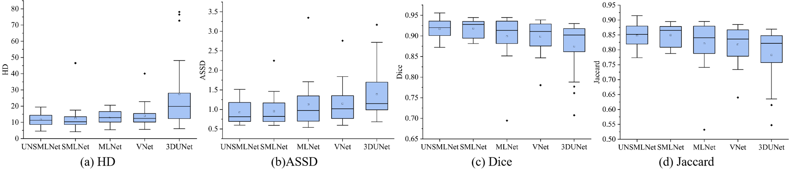

Code for our paper "Uncertainty Guided Symmetric Multi-Level Supervision Network for Left Atrium Segmentation on Late Gadolinium-Enhanced MRI". 

- Proposed an uncertainty guided objective function to refine the left atrium segmentation based on Jenson-Shannon (JS) discrepancy.
- Conducted an symmetric multi-level supervision network for multi-scale representation learning.

The pipeline of our method is show below:

<p align="center">
     
    
    Fig.1 An overview of the proposed uncertainty guided segmentation model with symmetric multiple supervision structure. 

## Requirements

Python 3.5

Keras based on Tensorflow

## Data process

Our model was trained and evaluated on 100 LGE MRI volumes of AF patients, which was provided by 2018 Atrial Segmentation Challenge in the STACOM 2018. Each volume contained 88 slices along Z direction with a spatial dimension of either $576\times576$ or $640\times640$. The ground truth of LA in this dataset was performed by three trained observers. The ground truth included LA endocardial surface with the mitral valve, LA appendage, and an part of the pulmonary veins (PVs).

We firstly extracted 2D slices along the Z direction. And then, these slices were cropped into $288\times288$ around the center of the slices to omit most of the unrelated region. The 100 volumes were randomly divided into training (N=72), validation (N=8), and testing (N=20) sets. The pixel value of these slices was normalized into $[0,1]$ by min-max normalization. For enlarging the training set, online augmentation approaches for the training slices were adopted.

## Training

**Run**

```python
train: python train.py
test: python test.py
```

## Results

Our segmentation model is evaluated by five evaluation metrics, which are **Dice score**, **Jaccard score**, **Normalized Surface Dice (NSD)**,  **Average Symmetric Surface Distance (ASSD)**, and **95% Hausdorff distance (95HD)**. We performed three group of experiments to evaluate the performance of the proposed model. Please refer to the original paper for more details.

The score of metrics during the test stage is shown in the box diagrams. 

<p align="center">
    
    
    Fig.2 Box diagrams for individual Dice Score, Jaccard, ASSD, 95HD, and NSD. The line and square in each box indicated the median and mean, respectively. The outliers were indicated by diamonds.
</p>


We reconstructed the worst predicted case (a) and the best predicted case (b) of our UN-SMLNet and the corresponding reconstructed predictions of other models through 3D Slicer .

<p align="center">
    
    
    Fig.3 3D Comparative results of (a) the worst case, and (b) the best case for UN-SMLNet. The ground truth is shown as red and the prediction is shown as blue. Dice Score of each model was shown in the right corner. The human markers which are generated from 3D Slicer are set at the left column for an intuitive view.
</p>

